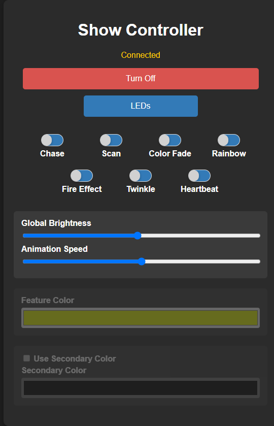
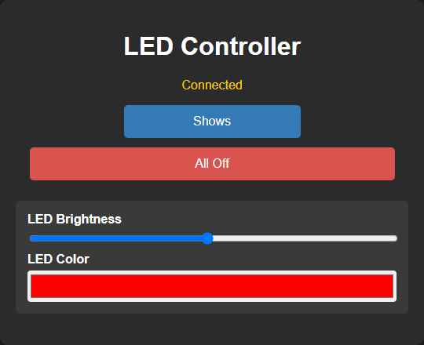
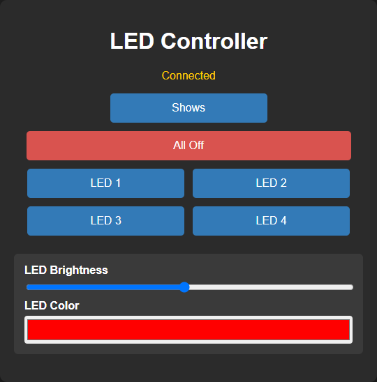

# Lightserver

## Ai Disclosure

I initially created this project a few years ago on an ESP8266 dev board. I struggled with getting the two main parts (web server and light show) to work together. Separately they worked fine. But combining them proved difficult. 

Then I decided to redo the project for an ESP32. This time I chose an ESP32-WROOM development board. That meant I'd start over with a majority of the code I had already written. And some of it could simply be recompiled.

That started me on the path to utilize Ai. At first it was by accident. I had googled a technical question regarding the ESP32, a web server, and neopixel. What I got back from the google Ai wasn't bad, so I ran with it and it mostly worked. Then I continued with google asking its Ai questions, and it would produce mostly workable code. Until it couldn't. I'm not sure why it failed, but all I was getting out of it was some nebulous error message.

So I took what I had and tried ChatGPT. It was able to create usuable and runnable code. But at the time I was using the "Free' tier. I couldn't get as far as I wanted, or as quickly. So that nudged me enough to pay for the lowest tier. 

I feel that was the right move. What ChatGPT did for me was take what I had and fix a few things, and then take me on a long refactoring journey. There were about fifty refactoring interations, was it long? Yes. Was it worth it? Definitely yes. 

ChatGPT did more than just the refactoring, it also did very well in explaining what it did and why it did it. Did ChatGPT make mistakes? Absolutely yes it did. But it also learned from them and fixed them when they were pointed out.

Bottom line... Ai saved me A LOT of time, effort, and it saved me from a lot of frustration too.

## Overview

**Lightserver** is an ESP32-based LED controller that provides a web interface for controlling an addressable LED strip.

The application combines:

- An ESP32 microcontroller
- An addressable LED strip driven through the `PixelStrip` abstraction
- Wi-Fi connectivity
- An asynchronous HTTP web server
- A WebSocket connection for real-time control and state updates
- A collection of built-in LED animations
- Individual/manual LED control
- Embedded HTML pages stored separately from the web-server implementation
- Wi-Fi connection and disconnect monitoring

The project is organized so that the major areas of responsibility are separated into modules. The main program (`lightserver.ino`) is intentionally small and primarily responsible for initialization and the main loop.

The project also uses a small, explicit public API between modules. Implementation details such as animation types, animation-name lookup tables, WebSocket broadcast functions, Wi-Fi event handling, and LED storage remain private to their respective `.cpp` files.

### Screenshots

<br><br>
<div align="center">
    <figure>
        
        <br>
        <figcaption><strong>Lightserver Index Page</strong></figcaption>
    </figure>
</div>
<br><br>

<div align="center">
    <figure>
        
        <br>
        <figcaption><strong>Lightserver LED Control Page - 1</strong></figcaption>
    </figure>
</div>
<br><br>

<div align="center">
    <figure>
        
        <br>
        <figcaption><strong>Lightserver LED Control Page - 2</strong></figcaption>
    </figure>
</div>
<br><br>

---

## Architecture

At a high level, the application is organized like this:

```text
                           ┌──────────────────────┐
                           │    lightserver.ino   │
                           │  setup() / loop()    │
                           └──────────┬───────────┘
                                      │
                 ┌────────────────────┼────────────────────┐
                 │                    │                    │
                 ▼                    ▼                    ▼
           ┌───────────┐       ┌────────────┐       ┌───────────┐
           │   Wi-Fi   │       │ Web Server │       │    LEDs   │
           │  wifi.*   │       │ webserver.*│       │  leds.*   │
           └─────┬─────┘       └─────┬──────┘       └─────┬─────┘
                 │                   │                    │
                 │                   ▼                    │
                 │            ┌─────────────┐             │
                 │            │   WebPages  │             │
                 │            │ webpages.*  │             │
                 │            └──────┬──────┘             │
                 │                   │                    │
                 │                   ▼                    │
                 │            ┌─────────────┐             │
                 │            │  WebSocket  │─────────────┤
                 │            │ websocket.* │             │
                 │            └──────┬──────┘             │
                 │                   │                    │
                 │                   ▼                    │
                 │            ┌─────────────┐             │
                 │            │  Commands   │             │
                 │            │ commands.*  │             │
                 │            └──────┬──────┘             │
                 │                   │                    │
                 │       ┌───────────┴───────────┐        │
                 │       ▼                       ▼        │
                 │ ┌──────────────┐        ┌─────────────┐│
                 └►│  Animations  │        │     LEDs    │◄┘
                   │ animations.* │        │   leds.*    │
                   └──────┬───────┘        └─────────────┘
                          │
                          ▼
                   ┌──────────────┐
                   │ PixelStrip   │
                   │ pixelstrip.h │
                   └──────────────┘
```

### Responsibilities

#### `lightserver.ino`

The application entry point.

`setup()`:

1. Initializes the serial interface when debugging is enabled.
2. Initializes the LED subsystem.
3. Initializes the animation subsystem.
4. Attempts to connect to Wi-Fi.
5. Reports the Wi-Fi connection result when debugging is enabled.
6. If Wi-Fi succeeds, initializes the HTTP/WebSocket server.
7. If Wi-Fi succeeds, starts the five-second `Ready` animation.
8. If Wi-Fi fails, skips web-server initialization and starts the `wifierror` animation.

`loop()`:

1. Cleans up inactive WebSocket clients.
2. Checks for a Wi-Fi disconnected event.
3. Starts the `wifierror` animation when a Wi-Fi disconnect event is consumed.
4. Updates the animation engine when an animation is running.
5. Sends the current LED data to the physical strip.

The detailed initialization of each subsystem is deliberately kept out of `lightserver.ino`.

---

## Wi-Fi Behavior

Wi-Fi configuration is stored in `config.cpp`.

`WiFiConnectionTimeout` specifies how long `initWiFi()` waits for the initial connection. The current value is **90 seconds**:

```cpp
const uint32_t WiFiConnectionTimeout = 90000;
```

`initWiFi()` returns:

- `true` when a Wi-Fi connection is established before the timeout.
- `false` when the timeout expires without a connection.

When the initial Wi-Fi connection fails:

- An error is reported on the serial connection when `DEBUG_SERVER` is enabled.
- The configured SSID is reported.
- The configured password is reported.
- The configured connection timeout is reported.
- The HTTP server and WebSocket server are **not** initialized.
- The `wifierror` animation is started.

The application does not currently attempt to reconnect automatically after an initial connection failure.

### Wi-Fi disconnect events

The Wi-Fi module registers a station-disconnected event using the current Arduino-ESP32 event API:

```cpp
WiFi.onEvent(onWiFiEvent, WiFiEvent_t::ARDUINO_EVENT_WIFI_STA_DISCONNECTED);
```

The event callback records the disconnect rather than directly starting an animation. `loop()` calls `consumeWiFiDisconnectedEvent()` and starts `wifierror` from the normal application context.

Automatic Wi-Fi reconnection after a disconnect is not currently implemented.

---

## Module API

### `config.h` / `config.cpp`

Contains application configuration.

Public configuration values include:

```cpp
extern const uint16_t PixelCount;
extern const uint8_t PixelPin;

extern const char *ssid;
extern const char *password;

extern const uint32_t WiFiConnectionTimeout;
```

`PixelCount`, `PixelPin`, and `WiFiConnectionTimeout` are defined in `config.cpp` and declared `extern` in `config.h`.

Keeping the definitions in `config.cpp` prevents every source file that includes `config.h` from creating its own definition.

---

### `wifi.h` / `wifi.cpp`

Responsible for the initial Wi-Fi connection and Wi-Fi disconnect event handling.

Public API:

```cpp
bool initWiFi();
bool consumeWiFiDisconnectedEvent();
```

`initWiFi()` waits up to `WiFiConnectionTimeout` milliseconds for the initial connection.

`consumeWiFiDisconnectedEvent()` returns `true` once when a station-disconnected event has been recorded, then clears the event. It returns `false` when no unconsumed disconnect event exists.

The Wi-Fi event callback itself remains private to `wifi.cpp`.

---

### `leds.h` / `leds.cpp`

Owns the physical LED strip and manual LED state.

Public API:

```cpp
void initLeds();
PixelStrip& getLeds();
void showLeds();
void clearLeds();

void setManualMode(bool enabled);
bool isManualMode();

void setManualLed(uint16_t index, bool state, const RgbColor* color = nullptr, const uint8_t* brightness = nullptr);

struct ManualLedState
{
    bool on;
    RgbColor color;
    uint8_t brightness;
};

bool getManualLedState(uint16_t index, ManualLedState& state);
void clearManualLeds();
void showManualLeds();
```

The module keeps its LED storage private.

`ManualLedState` provides a consolidated way to read an LED's complete manual state instead of requiring separate calls for its on/off state, color, and brightness.

`showManualLeds()` renders the current manual state to the physical LED strip.

---

### `animations.h` / `animations.cpp`

Owns animation selection, animation execution, animation state, and the in-memory settings for each user-selectable animation.

The animation system supports standalone animation implementations in the `animations/` folder. Each animation can have its own `.h` and `.cpp` source files while `animations.cpp` remains responsible for registering the animation and connecting it to the common animation manager. This keeps individual animations isolated and makes new animations easier to add without placing all rendering code in one source file.

Public animation-setting functions:

```cpp
void setAnimationColor(const RgbColor& color);
void setAnimationSecondaryColor(const RgbColor& color);
void setAnimationSecondaryEnabled(bool enabled);
void setAnimationBrightness(uint8_t brightness);
void setAnimationDuration(uint16_t duration);
```

`setAnimationSecondaryColor()` and `setAnimationSecondaryEnabled()` apply only to animations that support secondary colors. Currently these are **Color Fade** and **Fire Effect**.

The animation state snapshot exposed to the WebSocket layer is:

```cpp
struct AnimationStateSnapshot
{
    String name;
    RgbColor color;
    RgbColor secondaryColor;
    bool secondaryEnabled;
    uint8_t brightness;
    uint16_t duration;
    bool secondarySupported;
};
```

`secondarySupported` tells the web client whether the active animation supports a secondary color. The WebSocket layer uses this capability to update the secondary-color controls in the Show Controller.

Secondary color and secondary-enabled state are remembered independently for supported animations while Lightserver is running. They are not persisted across an ESP32 reset or program restart.

### `commands.h` / `commands.cpp`

Contains application-level commands.

This module separates command processing from the WebSocket transport layer.

Public API:

```cpp
CommandResult processCommand(JsonDocument& doc);
```

Commands currently supported include:

- `pattern`
- `brightness`
- `speed`
- `color`
- `secondaryColor`
- `secondaryEnabled`
- `led`
- `alloff`

`secondaryColor` changes the stored secondary color for the active animation when supported.

`secondaryEnabled` enables or disables use of the stored secondary color for the active animation when supported.

The command module changes application state but does not directly manage WebSocket transmission.

It returns a `CommandResult` containing the required state-broadcast order:

```cpp
enum class CommandBroadcastOrder : uint8_t
{
    None,
    AnimationOnly,
    ManualOnly,
    ManualThenAnimation,
    AnimationThenManual
};
```

This keeps WebSocket-specific broadcasting out of the application command handlers.

---

### `websocket.h` / `websocket.cpp`

Provides the WebSocket transport used by the web interface.

Public API:

```cpp
void initWebSocket(AsyncWebServer& server);
void cleanupWebSocketClients();
```

The module is responsible for:

1. Receiving WebSocket messages.
2. Parsing JSON.
3. Passing commands to `processCommand()`.
4. Broadcasting resulting state changes.
5. Sending current state when a WebSocket client connects.
6. Cleaning up inactive clients.

The actual command behavior is implemented in `commands.cpp`.

WebSocket state messages are generated by private functions such as:

```text
broadcastAnimationState()
broadcastManualState()
```

Both use the private `broadcastJson()` helper for the common JSON serialization/transmission operation.

---

### `webserver.h` / `webserver.cpp`

Owns the asynchronous HTTP server.

Public API:

```cpp
void initWebServer();
```

The HTTP server:

1. Registers the normal web pages from `webPages[]`.
2. Registers the configured error-page handler.
3. Initializes the WebSocket subsystem.
4. Starts the HTTP server.

The actual page definitions are deliberately kept out of this module.

The web server is initialized only after a successful initial Wi-Fi connection.

---

### `webpages.h` / `webpages.cpp`

Contains the embedded web pages and their route metadata.

Each page is described by a `WebPage` structure:

```cpp
struct WebPage
{
    const char* path;
    WebRequestMethodComposite method;
    const char* contentType;
    const char* content;
};
```

Normal pages are stored in:

```cpp
extern const WebPage webPages[];
```

Error pages are stored in:

```cpp
extern const WebPage errPages[];
```

Error page types are identified by:

```cpp
enum class ErrorPageTypes : uint8_t
{
    Page404
};
```

Both page arrays use a final entry whose `content` pointer is `nullptr` as the end-of-list marker.

The current normal routes are:

```text
/       → index.html
/leds   → led.html
```

The current error route is a custom HTTP 404 response using `404.html`.

In `webserver.cpp`, each normal page is copied into the registered request lambda with:

```cpp
[page]
```

This is intentional. Each route retains its own page metadata after the page-registration loop has completed.

---

### `pixelstrip.h`

Provides the project's LED-strip abstraction.

The LED and animation modules use this abstraction rather than exposing the underlying LED implementation throughout the application.

---

## Web Interface

The current web pages are:

```text
/        → Show Controller
/leds    → LED Controller
```

The Show Controller provides:

- Animation selection
- Global brightness
- Animation speed
- Feature color
- WebSocket connection status

The Animation Speed slider uses the speed range reported for the selected animation. This allows different animations to use different timing ranges. For example, the standard animations currently use a duration range of 200–8000 ms, while FlipFlop uses 100–1000 ms between state changes.

The LED Controller provides:

- Individual LED selection
- Individual LED color
- Individual LED brightness
- All Off
- WebSocket connection status

The browser communicates with the ESP32 through normal HTTP requests for pages and WebSockets for real-time LED control and state updates.

A request for an unknown HTTP path receives the embedded 404 page.

---

## WebSocket / Command Flow

A typical browser command follows this path:

```text
Browser
   │
   │ JSON over WebSocket
   ▼
websocket.cpp
   │
   │ processCommand()
   ▼
commands.cpp
   │
   ├──────────────► animations.cpp
   │
   └──────────────► leds.cpp
   │
   ▼
CommandResult
   │
   ▼
websocket.cpp
   │
   ├── broadcastAnimationState()
   └── broadcastManualState()
```

This separation is intentional:

- **WebSocket** handles transport.
- **Commands** handle application commands.
- **Animations** handle animation behavior.
- **LEDs** handle physical LED state and rendering.

---

## Startup Sequence

The normal startup sequence is:

```text
ESP32 reset
    │
    ▼
setup()
    │
    ├── Serial initialization
    │
    ├── initLeds()
    │
    ├── initAnimations()
    │
    └── initWiFi()
             │
       ┌─────┴─────┐
       │           │
   SUCCESS       FAILURE
       │           │
       ▼           ▼
initWebServer()  report error
       │         start wifierror
       │
       ▼
"HTTP server started"
       │
       ▼
startAnimation("ready")
```

If the initial Wi-Fi connection fails, the web server and WebSocket server are not initialized.

After a successful connection, if Wi-Fi subsequently disconnects:

```text
Wi-Fi disconnect event
          │
          ▼
   wifi.cpp records
       the event
          │
          ▼
     loop() calls
consumeWiFiDisconnectedEvent()
          │
          ▼
startAnimation("wifierror")
```

Automatic Wi-Fi reconnection is not currently implemented.

---

## Adding a New Animation

New user-selectable animations should be implemented as standalone source files in the `animations/` folder. See the [Animation Specification Template](./animation_template.md) for the format used to describe a new animation before implementation.

The recommended process is:

1. Create a markdown specification for the animation using `animation_template.md`.
2. Create `animations/<name>.h` and `animations/<name>.cpp` for the animation implementation.
3. Include the common `PixelStrip` type from the project root when required, for example:

   ```cpp
   #include "../pixelstrip.h"
   ```

4. Add the animation's private `AnimationType` to `animations.cpp`.
5. Add the animation to the animation-name mapping used to select it.
6. Add an `AnimationInfoDefinition` entry containing its internal name, display label, and speed range.
7. Connect the animation implementation to the animation manager without changing the public API unless the animation requires a new capability that the existing API does not provide.
8. Increment `ProtocolVersion::ShowInfo` when the available animations or their reported capabilities change. This causes browsers with cached `showInfo` data to request the updated information.

Each animation's reported speed range is used by the Show Controller to configure its Animation Speed slider. The `minDuration` and `maxDuration` values describe the duration between animation state changes, so the meaning of the speed control can be different from the complete cycle duration of an animation.

The goal is for future animations to require only a small registration change in the manager plus their own standalone `.h` and `.cpp` files. Existing animations should not need to be modified merely because another animation is added.

System-status animations such as `wifierror` may use fixed parameters instead of the normal user-controlled animation state and are not added to the user-selectable animation list.

---

## Animation Settings

Each user-selectable animation remembers its settings independently while Lightserver is running. The settings are held in memory only and are not retained across an ESP32 reset or program restart.

### Animation Speed Ranges

Animation speed is represented internally as a duration in milliseconds between animation state changes. Each user-selectable animation reports its own minimum and maximum duration to the web client. The Show Controller uses those values to configure the Animation Speed slider for the selected animation.

The current standard animations use:

- **Minimum duration:** `200 ms`
- **Maximum duration:** `8000 ms`

FlipFlop uses:

- **Minimum duration:** `100 ms`
- **Maximum duration:** `1000 ms`

The names **Minimum Speed** and **Maximum Speed** in animation specifications refer to the slowest and fastest ends of the animation's timing range. When documenting an animation, always state the actual duration between state changes so the intended behavior is unambiguous.

The default settings for user-selectable animations are:

- **Color:** red
- **Brightness:** 1/2 (`128`)
- **Speed:** 1/2 of the available speed range (`4100 ms`)

When an animation is selected, its saved settings are loaded and the current animation state is sent to connected web clients. The Show Controller updates its controls to match the selected animation.

The following settings are remembered independently for each user animation:

- Color
- Brightness
- Speed

The system animations are not part of this per-animation settings system:

- `off`
- `ready`
- `wifierror`

These animations retain their existing fixed behavior.

### Rainbow and Twinkle

`rainbow` and `twinkle` do not use the user-selected color. Their color picker is disabled in the Show Controller while either animation is running.

For these two animations:

- **Speed is remembered.**
- **Brightness is remembered.**
- **Color is not remembered.**
- The animation state broadcast does not include a color value.

This prevents a color selected for another animation from affecting or being unnecessarily associated with Rainbow or Twinkle.

## Secondary Colors

Two animations support a secondary color:

- `Color Fade`
- `Fire Effect`

The ESP32 reports whether the active animation supports a secondary color to the web client. This allows the Show Controller to enable or disable the secondary-color controls without maintaining a separate list of animation capabilities in the HTML.

For supported animations, the Show Controller provides:

- A **Use Secondary Color** checkbox.
- A **Secondary Color** picker.

The secondary color and whether it is enabled are remembered independently for each supported animation while Lightserver is running. They are not retained across an ESP32 reset or program restart.

### Color Fade

When **Use Secondary Color** is enabled, Color Fade transitions between the primary and secondary colors.

When it is disabled, the secondary color is effectively black, preserving the original Color Fade behavior of transitioning between the selected color and the LEDs being off.

### Fire Effect

When **Use Secondary Color** is enabled, Fire Effect uses the selected secondary color.

When it is disabled, Fire Effect uses its existing fixed secondary color (`#FFFF64`), preserving the original Fire Effect behavior.

### Brightness

Global Brightness applies to both primary and secondary colors when they are used. The animation calculates the resulting color first and then applies the global brightness level.

Rainbow and Twinkle do not support secondary colors. Their existing behavior remains unchanged: they remember brightness and speed, but not color.

## Adding a New Web Page

The HTML pages are maintained as readable source files in the repository. The current HTML files are used by the ESP32 application; their contents are embedded into the firmware rather than being loaded from a filesystem at runtime.

To add a normal page:

1. Create or modify the HTML source file.
2. Optionally run `esp32min.js` to create a minimized copy and the corresponding C++ source.
3. Use the resulting page content when updating the embedded page content used by the ESP32 application.
4. Add a `WebPage` entry to the `webPages[]` array.
5. Ensure the final entry remains the end-of-list marker.

To add an error page:

1. Create or modify the HTML source file.
2. Optionally run `esp32min.js`.
3. Use the resulting page content when updating the embedded page content used by the ESP32 application.
4. Add an entry to `errPages[]`.
5. Add an appropriate value to `ErrorPageTypes` when indexed access is required.
6. Ensure the final entry remains the end-of-list marker.

The HTTP server does not need another hard-coded `server.on()` call for each new page.

### HTML Minimization with `esp32min.js`

`minimize/esp32min.js` is an independent Node.js utility for reducing the size of an HTML file before it is embedded in the ESP32 firmware. It removes HTML, CSS, and JavaScript comments where appropriate, removes unnecessary whitespace, and removes whitespace between HTML tags.

The utility is intentionally independent of the Lightserver ESP32 source code. It does not know about `webpages.cpp`, the `WebPage` structure, or where the generated C++ content will eventually be used.

Run it from the `minimize` directory. The input may be a relative or absolute path, for example:

```text
node esp32min.js ..\index.html
```

The utility writes both output files to the **current working directory**:

```text
_index.html
_index_html.cpp
```

For an input file named `ledctl.html`, the outputs are:

```text
_ledctl.html
_ledctl_html.cpp
```

The underscore-prefixed HTML file contains the minimized HTML and is intended for browser testing. The underscore-prefixed C++ file contains the same minimized HTML inside a `PROGMEM` raw C++ string literal.

The generated C++ variable name is based on the original input filename. For example, `_index_html.cpp` contains:

```cpp
const char index_html[] PROGMEM = R"rawliteral(
[minimized HTML]
)rawliteral";
```

Existing output files are overwritten.

The utility also checks for the sequence `)rawliteral` in the minimized HTML because that sequence would terminate the C++ raw string literal prematurely.

`esp32min.js` takes exactly one input argument, and the input file must have an `.html` extension.

### Minimization Is Optional

Minimization is **optional**. The original readable HTML can be used instead.

The current HTML used by this repository is minimized before being embedded in the ESP32 application. Testing showed that minimization reduced program storage usage by approximately **3 KB**.

The recommended workflow is:

```text
Edit HTML
   ↓
Run esp32min.js
   ↓
Generate C++
   ↓
Generate minimized HTML test file
   ↓
Test _*.html file
   ↓
Use the minimized content in the ESP32 application
```

The `_*.html` output provides a convenient way to verify the minimized page in a browser before putting the minimized content into the firmware.

---

## Build Environment

The project is intended for the ESP32 using the Arduino IDE and the libraries already used by the project, including:

- ESP32 Arduino core
- `ESPAsyncWebServer`
- `ArduinoJson`
- `NeoPixelBus` / `NeoPixelAnimator` functionality used by the project

The project has been developed and tested incrementally on the target ESP32 hardware.

---

## Current Status

The current baseline includes:

- Modular LED, animation, Wi-Fi, command, web-server, web-page, and WebSocket code
- Standalone animation source files under the `animations/` folder
- Per-animation speed ranges reported to the web client
- Browser `showInfo` versioning so animation-list changes invalidate cached show information
- A 90-second configurable initial Wi-Fi connection timeout
- Wi-Fi connection failure reporting
- `wifierror` animation on initial Wi-Fi connection failure
- Wi-Fi station-disconnect event detection
- `wifierror` animation when an established Wi-Fi connection is lost
- HTTP/WebSocket server startup only after successful initial Wi-Fi connection
- A dedicated embedded 404 page
- Consolidated animation and manual LED state APIs
- Embedded web pages managed through page metadata tables

Automatic Wi-Fi reconnection is intentionally not implemented at this time.
